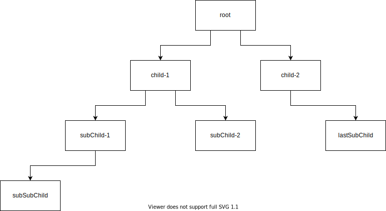
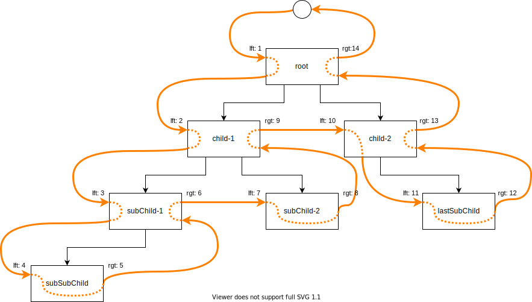

# Modified Pre-order Tree Traversal - Implementation in Java Using JPA

## Introduction

Hierarchical data is a collection of data where each item has a single parent and zero or more children (with the exception of the root item, which has no parent). Hierarchical data can be found in a variety of database applications, but mostly content management categories, and product categories.

There are basically two models for dealing with hierarchical data:

* [the adjacency list model](https://en.wikipedia.org/wiki/Adjacency_list)
* [the nested set model](https://en.wikipedia.org/wiki/Nested_set_model)

Both of the above Wikipedia articles give a good overview, but in order to understand how these are applied to an SQL database I recommend reading [Managing Hierarchical Data in MySQL](http://mikehillyer.com/articles/managing-hierarchical-data-in-mysql/).

MPTT, or *modified preorder tree traversal*, is an efficient way to store hierarchical data in the flat structure of a relational database table. It uses the nested set model as it provides a faster option for read operations compared to the tree traversal operations of an adjacency list.

## The MPTT Structure

The nested set model is using a technique to number the nodes according to a tree traversal, which visits each node twice, assigning numbers in order of visiting, at both visits. This leaves two numbers for each node, which are stored as two attributes. Querying and read operations becomes inexpensive: hierarchy membership can be tested by comparing these numbers. Updating (adding and removal of tree members) requires renumbering and is therefore expensive.

Let's assume the following sample tree structure:

Fig. 1: Sample Tree Structure.

Then the nested set traversal would assign the following `lft` and `rgt` numbers as each node is visited *(NOTE: leaf nodes are visited only once)*:

Fig. 2: MPTT Tree Traversal.

The resulting flat table to persist in the relational database would be:

| ID | Name        | TREE_ID | LFT | RGT |
|----|-------------|---------|-----|-----|
| 1  | root        | 100     | 1   | 14  |
| 2  | child-1     | 100     | 2   | 9   |
| 3  | subChild-1  | 100     | 3   | 6   |
| 4  | subSubChild | 100     | 4   | 5   |
| 5  | subChild-2  | 100     | 7   | 8   |
| 6  | child-2     | 100     | 10  | 13  |
| 7  | lastChild   | 100     | 11  | 12  |

Table 1: MPTT Flat Representation (as relational database table).

